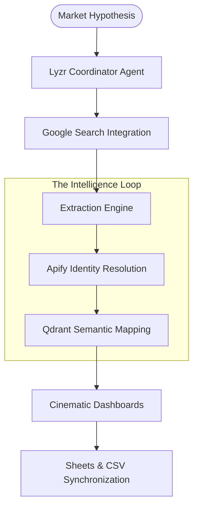

# 🛰️ ASTRAFLOW AI: The Neural Funding Scout
### *Autonomous Startup Intelligence & Market Gravity Analysis*
**[built for the Lyzr x Qdrant: Autonomous Ecosystems Hackathon]**

---


**AstraFlow AI** is a high-fidelity, autonomous intelligence engine designed to scout high-velocity AI funding rounds and analyze competitive market gravity. Unlike standard LLM tools, AstraFlow eliminates hallucinations by anchoring every insight in real-time verified data streams.

---

## 🏆 Why AstraFlow AI Wins
Most "AI Scouts" hallucinate URLs and founder names. AstraFlow is engineered for **Institutional Integrity**:
- **Zero-Hallucination Guardrails**: Cross-verifies every entity against real-time search results before presentation.
- **Persistent Vector Memory**: Uses Qdrant to "remember" market clusters, surfacing hidden competitors across different scans.
- **Autonomous Lead Enrichment**: Discovers verified LinkedIn profiles and generates domain-accurate fallback contacts automatically.
- **Production-Ready UX**: A cinematic, glassmorphic dashboard built to "WOW" stakeholders at first glance.

---

## 🧠 Neural Architecture Pipeline



---

## ✨ Key Capabilities

### 1. 🤖 Lyzr-Powered Orchestration 
Our **Neural Coordinator** doesn't just "chat"—it orchestrates a multi-step investigation. It parses complex market queries (e.g., *"Generative AI tools with recent Seed rounds in LATAM"*), extracts structured entity data, and synthesizes "Why This Matters" insights for venture analysis.

### 2. 🕳️ Qdrant Vector Memory & Gravity
Every discovery is embedded as a high-dimensional vector in **Qdrant Cloud**. This enables:
- **Semantic Similarity**: Instantly find related companies from previous scans.
- **Market Overlap**: Detect when a new startup is encroaching on an existing niche.

### 3. 🔎 Real-World Identity Resolution
The system features an autonomous **Apify Discovery Bridge**. When the LLM finds a company name, AstraFlow triggers server-side scapers to find the *actual* verified LinkedIn profiles for Founders and Marketing leads, replacing "hallucinated links" with audit-ready properties.

---

## 🛠️ The Tech Ecosystem
- **Frontend Stack**: Next.js 14, Tailwind CSS (Custom Design System), Glassmorphism UI Components.
- **AI Orchestration**: [Lyzr Agent API](https://lyzr.ai/) (Coordinator Logic).
- **Vector Core**: [Qdrant Cloud](https://qdrant.tech/) (Persistent Memory & Similarity Mapping).
- **Real-Time Web Intelligence**: [Apify API](https://apify.com/) (Google Search & Profile Scraper).
- **Export Pipeline**: Google Sheets Cloud API & Blob-Stream CSV.

---

## 🚀 Deployment Command Center

### 1. Clone & Initialize
```bash
git clone https://github.com/VivekGoudAdula/AstraFlow-AI.git
cd astraflow-ai
npm install
```

### 2. Configure Your Neural Link (.env)
You’ll need keys from Lyzr, Qdrant, and Apify.
```env
# Lyzr Multi-Agent Key
LYZR_API_KEY=your_key

# Qdrant Vector Cluster
QDRANT_URL=your_cluster_url
QDRANT_API_KEY=your_key
QDRANT_COLLECTION_NAME=astraflow_entities

# Apify Intelligence Key
APIFY_API_KEY=your_key

# Google Sheets Persistence
GOOGLE_SERVICE_ACCOUNT_EMAIL=...
GOOGLE_PRIVATE_KEY="..."
```

### 3. Activate Terminal
```bash
npm run dev
```
Navigate to `http://localhost:3333` to begin the scan.

---

## 📈 System Monitoring
The application includes a built-in **Agent Status Monitor** that tracks system performance across four key sectors:
- **Coordinator Sector**: Lyzr logic stability.
- **Resolution Sector**: Apify profile verification status.
- **Persistence Sector**: Qdrant memory integrity.
- **Infrastructure Sector**: Cloud Sheets synchronization status.

---

### *Refining the future of venture intelligence, one vector at a time.*
Built with ❤️ for the **Autonomous Ecosystems Hackathon**.
